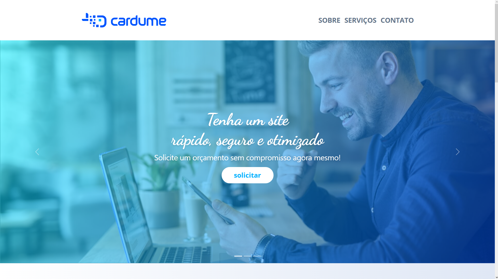

# Teste Cardume Digital

Reprodução Do [Layout](https://xd.adobe.com/view/fae87770-c4c5-4cef-800d-6d9e7bfaeb99-afbb/) proposto pela empresa [Cardume Digital](https://cardume.digital/) Para Um Teste De Uma Vaga De Desenvolvedor Front-End. Foi Utilizado HTML, CSS, Javascript e o Framework [Bootstrap](https://getbootstrap.com/).

 

Na Imagem Acima Temos em Destaque o Slider de Imagens com um Texto. Logo Abaixo, um Botão de Solicitar Orçamento que Direciona para um Formulário no Final da Página. Após o Slider Temos uma Seção de Sobre Nós com uma Descrição da Empresa, uma Seção de Serviços Oferecidos e um Mapa com a Localização da Empresa. 

 
